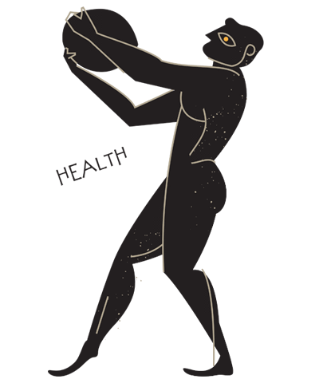

# Object Calisthenics Workshop

Sample PHP code to demonstrate Object calisthenics though a hands-on workshop.



> __Calisthenics__: Greek therm used to describe gymnastics exercises done by olympic athletes.   

The term `Object-Calisthenics` was coined by `Jeff Bay` in the book `Thought Works Anthology` (2008)
as a group of exercises that can help programmers to write better object-oriented code.

By doing the exercises it helps you increase code:

- :white_check_mark: Readability.
- :white_check_mark: Maintainability.
- :white_check_mark: Comprehensibility.
- :white_check_mark: Flexibility.
- :white_check_mark: Testability.

## :warning: Important consideration

Besides Object-Calisthenics are very good exercises and definitely will help you improve your code quality, 
they are not ultimate rules that must be followed strictly, but they will for sure educate you and make you reason
about the code while writing it.

After doing the exercises and being aware about the benefits, naturally you will be uncomfortable when 
not applying them.

You can adapt/ignore rules according to your organization, but give it a try in a few projects before avoiding 
it completely. As humans we tend to block ourselves every time leaving a comfort zone.   

## The 9 Rules of Object-Calisthenics

- [Rule 1: One level of indentation per method](src/Rule1) 
- [Rule 2: Don’t use the ELSE keyword](src/Rule2)
- [Rule 3: Wrap all primitives and Strings](src/Rule3)
- [Rule 4: First class collections](src/Rule4)
- [Rule 5: One dot per line](src/Rule5)
- [Rule 6: Don’t abbreviate](src/Rule6)
- [Rule 7: Keep all entities small](src/Rule7)
- [Rule 8: No classes with more than two instance variables](src/Rule8)
- [Rule 9: No getters/setters/properties](src/Rule9)

## Exercises

The goal is to fix all the errors reported by the ObjectCalisthenics rule set:

### 1. Check current errors:

```shell script
bin/phpcs src --standard=object-calisthenics-ruleset.xml
```
#### Rules not validated

Some rules are not automatically validated, so you need to check by yourself, with others or sharing with me.

- :x: 3. Wrap Primitive Types and Strings.
- :x: 4. Use First Class Collections.
- :x: 8. Do Not Use Classes With More Than Two Instance Variables.

#### Extra - Validate using PHPMD

You can also validate your code according to PHPMD to see how calisthenics can decrease code complexity:

- [Code Size](https://phpmd.org/rules/codesize.html)
- [Clean Code](https://phpmd.org/rules/cleancode.html)
- [Controversial](https://phpmd.org/rules/controversial.html)
- [Design](https://phpmd.org/rules/design.html)
- [Naming](https://phpmd.org/rules/naming.html)
- [Unused code](https://phpmd.org/rules/unused.html)

```shell script
bin/phpmd src ansi phpmd-ruleset.xml --suffixes php
```

### 2. Refactor the code

Now you need to refactor the code in order to clear the object calisthenics

### 3. Go to step number one

Go to step number 1 until you do not get any errors.

## Requirements

- PHP 7.2+
- [Composer](https://getcomposer.org/)

## Installation

1. Download the source code.
2. Run composer

```shell script
composer install
```
  
## References

The knowledge to create this code examples and about Object Calisthenics 
is fruit of my working experience as software developer and based the 
references bellow. To the authors, thank you for all the valuable content. 

- William Durand: https://williamdurand.fr/2013/06/03/object-calisthenics/
- Guilherme Blanco: https://www.slideshare.net/guilhermeblanco/object-calisthenics-applied-to-php  
- Jeff Bay: https://www.cs.helsinki.fi/u/luontola/tdd-2009/ext/ObjectCalisthenics.pdf
- Thought Works Anthology - Technology Innovation: https://www.amazon.com/ThoughtWorks-Anthology-Technology-Innovation-Programmers/dp/193435614X

### Image sources:

- Olympic Athlete: https://cdn.shopify.com/s/files/1/0054/0488/5063/files/Olyra-Wisdom-Treats-Blog-Diet-Of-Athletes-In-Ancient-Greece-1_large.png?v=1557398665